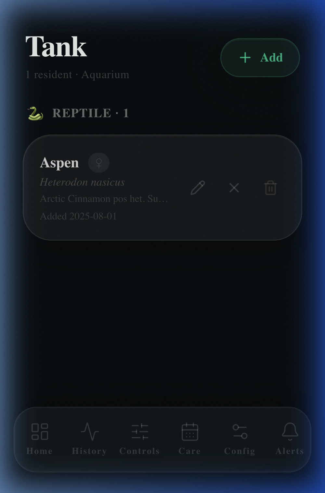

# HabitatMQ

**Self-hosted smart enclosure monitoring for reptiles, amphibians, and aquariums — built for a Raspberry Pi.**

HabitatMQ is a mobile-first dashboard that puts real-time sensor data, animal profiles, feeding logs, camera streams, lighting schedules, and PID temperature control in your pocket. No cloud. No subscriptions. Runs entirely on your local network.

> Originally built for Aspen, a Western Hognose Snake. Designed to adapt to any enclosure.

---

## Screenshots

<table>
  <tr>
    <td align="center"><b>Dashboard</b></td>
    <td align="center"><b>Sensor History</b></td>
    <td align="center"><b>Controls</b></td>
  </tr>
  <tr>
    <td></td>
    <td></td>
    <td></td>
  </tr>
  <tr>
    <td align="center"><b>Care Log</b></td>
    <td align="center"><b>Tank</b></td>
    <td align="center"><b>Config</b></td>
  </tr>
  <tr>
    <td></td>
    <td></td>
    <td></td>
  </tr>
  <tr>
    <td align="center"><b>Alerts</b></td>
  </tr>
  <tr>
    <td></td>
  </tr>
</table>

---

## Quick Start

### Docker Compose (recommended)

```bash
git clone https://github.com/jonchen727/HabitatMQ.git
cd HabitatMQ
docker compose up -d
```

Open [http://localhost:3003](http://localhost:3003) — dashboard is ready. Data persists in `./data/`.

Pre-built multi-arch images are available for **AMD64** and **ARM64** (Raspberry Pi):

```bash
docker pull ghcr.io/jonchen727/habitatmq:latest
```

### Local Development

```bash
git clone https://github.com/jonchen727/HabitatMQ.git
cd HabitatMQ
npm install
cp .env.example .env.local
npm run dev
```

Open [http://localhost:3003](http://localhost:3003). The SQLite database is created automatically on first run. No MQTT broker required for basic UI development.

> See **[GETTING_STARTED.md](GETTING_STARTED.md)** for full setup instructions including Raspberry Pi deployment, camera configuration, and Cloudflare Tunnel remote access.

---

## Features

| Feature | Details |
|---------|---------| 
| 🌡️ **Live sensor dashboard** | Real-time temperature & humidity gauges with color-coded status |
| 📈 **Sensor history** | 1H / 6H / 24H / 7D charts with rollup tables, threshold lines, and enriched tooltips showing control states + motion snapshots |
| 🎛️ **Device controls** | On/Off/Auto modes, solar schedule (sunrise/sunset), PID setpoint with day/night scheduling |
| 📅 **Care log** | Calendar view with per-animal feeding, shedding, handling, observation events and daily temperature extremes |
| 🐍 **Inhabitant profiles** | Reptile and aquarium types, weight tracking, growth percentile, life stage detection |
| 📷 **Camera streaming** | Zero-transcode RTSP via go2rtc, ONVIF auto-discovery, motion detection |
| 👁 **Motion timeline** | Motion detection events overlaid on sensor history with 1fps snapshot capture and hover filmstrip |
| 📸 **Photo log** | Attach photos to care events with auto-compression and full-screen lightbox |
| 🔔 **Alerts** | Configurable warning/critical thresholds with alert history |
| 📡 **MQTT telemetry** | Standard MQTT broker — works with ESPHome, Tasmota, custom sensors |
| 🌐 **Remote access** | Cloudflare Tunnel support — view your enclosure from anywhere |
| 📱 **Mobile-first** | Designed for iPhone; works on any phone browser |

---

## Architecture

```
┌───────────────────────────────────────────────────────┐
│                    Browser (phone)                     │
│  Dashboard · History · Controls · Care · Config       │
└───────────────────┬───────────────────────────────────┘
                    │ HTTP / WebSocket
                    ▼
┌───────────────────────────────────────────────────────┐
│              HabitatMQ (Next.js 16)                   │
│  ┌─────────┐  ┌──────────┐  ┌──────────────────────┐ │
│  │ API     │  │ MQTT.js  │  │ WS Proxy (server.js) │ │
│  │ Routes  │  │ Client   │  │ → go2rtc:1984        │ │
│  └────┬────┘  └────┬─────┘  └──────────┬───────────┘ │
│       │            │                    │             │
│  ┌────▼────┐  ┌────▼─────┐  ┌──────────▼───────────┐ │
│  │ SQLite  │  │ Mosquitto│  │ go2rtc (RTSP/ONVIF)  │ │
│  │ (data/) │  │ :1883    │  │ :1984                │ │
│  └─────────┘  └──────────┘  └──────────────────────┘ │
└───────────────────────────────────────────────────────┘
```

---

## Camera Support

HabitatMQ uses [go2rtc](https://github.com/AlexxIT/go2rtc) for zero-transcode camera streaming. No ffmpeg CPU overhead on the Pi.

| Protocol | How it works |
|----------|-------------|
| **RTSP** | Direct H.264 passthrough — no transcoding |
| **ONVIF** | Auto-discovers cameras on your LAN |
| **MSE** | Browser-native MediaSource Extensions playback via WebSocket |
| **MJPEG** | Fallback for browsers without MSE support |

Cameras are configured in the dashboard Config page. ONVIF cameras are discovered automatically.

---

## Page Documentation

| Page | Description |
|------|-------------|
| [Dashboard](docs/dashboard.md) | Live sensor gauges, device controls, Pi system stats |
| [Sensor History](docs/history.md) | Time-series charts — 1H / 6H / 24H / 7D |
| [Controls](docs/controls.md) | Device management — on/off/auto, solar schedule, PID |
| [Care Log](docs/care.md) | Feeding, shedding, handling, weight log with calendar |
| [Inhabitants](docs/inhabitants.md) | Animal profiles, weight tracking, growth percentile |
| [Config](docs/config.md) | Sensors, MQTT, cameras, location, alert thresholds |
| [Alerts](docs/alerts.md) | Threshold violation history and alert configuration |

---

## Hardware

| Component | Recommended |
|-----------|-------------|
| **Computer** | Raspberry Pi 4 or 5 (2GB+ RAM) |
| **OS** | Raspberry Pi OS Lite 64-bit |
| **Sensors** | DHT22, BME280, or any MQTT-publishing sensor |
| **Camera** | Any RTSP/ONVIF IP camera (e.g., Tapo C120) |
| **Heating** | SSR or PWM relay for PID control (optional) |

---

## Tech Stack

- **Frontend** — Next.js 16 (App Router), Tailwind CSS 4, Framer Motion, Recharts
- **Backend** — Next.js API routes, SQLite via `better-sqlite3`
- **Telemetry** — MQTT over WebSocket (`mqtt.js`)
- **Camera** — go2rtc (zero-transcode RTSP/ONVIF streaming)
- **Remote access** — Cloudflare Tunnel (optional)
- **Deployment** — Docker multi-arch (AMD64 + ARM64) via GHCR

---

## MQTT Sensor Format

Publish sensor readings to `{MQTT_TOPIC_PREFIX}/{sensor_id}` as JSON:

```json
{ "temperature": 87.2, "humidity": 45.1, "unit": "F" }
```

HabitatMQ maps incoming topics to sensor widgets via the Config page. Supports any MQTT-compatible sensor (ESPHome, Tasmota, custom Arduino/ESP32).

---

## Adapting for Your Animal

Select a profile type when adding an inhabitant — the care log, stats, and alert labels adapt automatically.

| Profile | Care event types |
|---------|-----------------|
| **Reptile** | Feeding, Shedding, Handling, Cleaning, Bedding change, Vet visit, Observation |
| **Aquarium** | Water change, Feeding, Water test, Dosing, Equipment check |

Multi-enclosure support is built-in — switch between animals using the top navigation picker.

---

## Environment Variables

| Variable | Default | Description |
|----------|---------|-------------|
| `MQTT_BROKER_URL` | `mqtt://localhost:1883` | MQTT broker address |
| `MQTT_TOPIC_PREFIX` | `enclosure` | Topic prefix for sensor data |
| `PORT` | `3003` | HTTP server port |
| `GO2RTC_HOST` | `localhost` | go2rtc API host |
| `GO2RTC_PORT` | `1984` | go2rtc API port |
| `DATA_DIR` | `./data` | SQLite database directory |

---

## Contributing

See [CONTRIBUTING.md](CONTRIBUTING.md). Bug reports and PRs welcome — especially for new animal profiles and sensor integrations.

---

## Changelog

See [CHANGELOG.md](CHANGELOG.md) for release history, or view the changelog in-app via **Settings → Changelog**.

---

## License

**CC BY-NC-SA 4.0** — free for personal and hobbyist use, no commercial use, forks must keep the same license. See [LICENSE](LICENSE).
