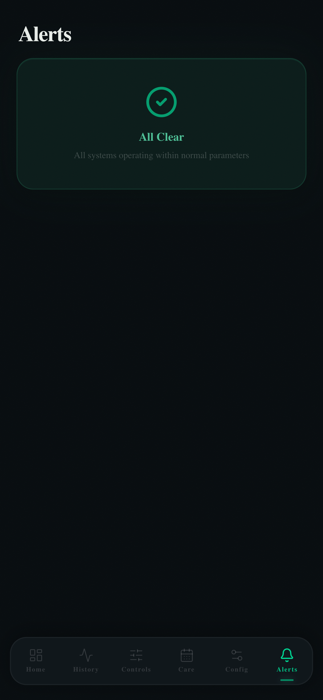

# Alerts

The Alerts page shows a history of threshold violations — any time a sensor reading exceeded a warning or critical threshold. When all systems are normal, a green "All Clear" card is displayed.



---

## All Clear State

When no thresholds have been breached, the page shows:

> ✅ **All Clear**
> All systems operating within normal parameters

This is the expected state during normal operation. The 🔔 tab icon in the bottom nav remains undecorated when alerts are clear.

---

## Alert Levels

| Level | Trigger | Icon | Color |
|-------|---------|------|-------|
| **Warning** | Reading crossed warning low/high | ⚠ | Yellow |
| **Critical** | Reading crossed critical low/high | 🚨 | Red |

Thresholds are configured per-sensor in Config → Sensors.

---

## Alert Cards

Each alert card shows:

| Field | Description |
|-------|-------------|
| **Sensor name** | Which sensor triggered the alert |
| **Level** | Warning or Critical |
| **Value** | The reading that triggered the breach |
| **Threshold** | The configured limit that was crossed |
| **Timestamp** | When the breach occurred |
| **Duration** | How long the reading stayed out of range (if resolved) |
| **Resolved** | Whether the sensor has returned to normal |

---

## Alert Badge

When there are active (unresolved) alerts, the 🔔 icon in the bottom tab bar shows a red dot badge. The badge clears automatically when all sensors return to within threshold ranges.

---

## Configuring Thresholds

Thresholds are set per-sensor in **Config → Sensors**. For each sensor you can define:

| Threshold | Recommended use |
|-----------|----------------|
| **Warning Low** | Slightly below ideal range (e.g. 82°F hot side) |
| **Warning High** | Slightly above ideal range (e.g. 95°F hot side) |
| **Critical Low** | Dangerous low (e.g. 70°F — heat pad likely failed) |
| **Critical High** | Dangerous high (e.g. 105°F — overheating) |

### Example thresholds for a Western Hognose

| Sensor | Warn Low | Warn High | Crit Low | Crit High |
|--------|----------|-----------|----------|-----------|
| Hot Side Substrate | 82°F | 92°F | 75°F | 100°F |
| Cold Side Substrate | 65°F | 76°F | 58°F | 82°F |

---

## Alert History

All alerts are stored in SQLite with their full timeline. There is no automatic expiry — you have a permanent record of every temperature excursion your enclosure has experienced.

To query alert history directly:

```sql
SELECT sensor_name, level, value, threshold, triggered_at, resolved_at
FROM alerts
ORDER BY triggered_at DESC
LIMIT 50;
```
