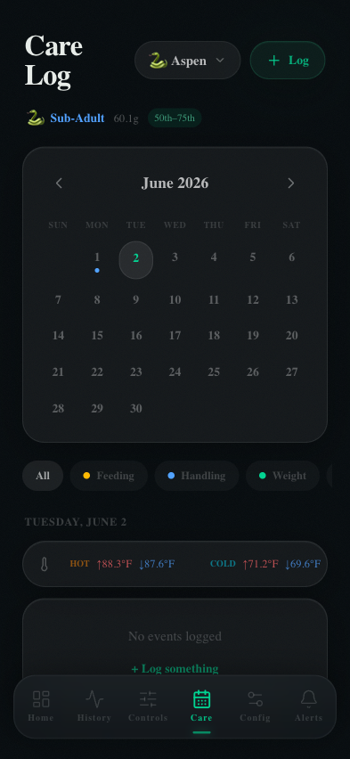

# Care Log

The Care Log tracks everything that happens with your animal over time — feedings, sheds, handling sessions, weight checks, vet visits, and more. Events are shown on a calendar with color-coded dots, and you can filter by event type.

---

## Care Stats Banner

At the top of the page, a compact stats chip shows the selected animal's current status:

| Element | Description |
|---------|-----------|
| **Life stage emoji + label** | 🥚 Hatchling, 🐍 Juvenile, 🐍 Sub-adult, 🐍 Adult — based on species growth data and age |
| **Current weight** | Most recent weight entry (e.g. `52g`) |
| **Growth percentile** | Where the animal falls vs. published growth curves (e.g. `50th–75th`) — green for on-track, amber for high/low |

This banner updates whenever new weight entries are logged.

---

## Calendar

The monthly calendar shows a dot indicator on each day that has logged events. Multiple dots appear side by side when multiple event types occurred on the same day.

| Dot color | Event type |
|-----------|-----------|
| 🟡 Yellow | Feeding |
| 🔵 Blue | Handling |
| 🟢 Teal | Weight check |
| 🟣 Purple | Shedding |
| ⚪ Gray | Other / Cleaning / Vet |

**Navigation:**
- `<` / `>` arrows to step month by month
- Today's date is circled
- Tap any date to jump to its event list

---

## Event Type Filters

Below the calendar, a scrollable chip row lets you filter the event list:

| Filter | Shows |
|--------|-------|
| **All** | Every event type |
| **Feeding** | Food offerings and refusals |
| **Handling** | Handling sessions |
| **Weight** | Weight measurements |
| **Shedding** | Shed start, in-shed, complete |
| **Bedding** | Substrate changes (full or spot) |
| **Cleaning** | Enclosure cleaning events |
| **Observe** | Feeding, behavior, and medical observations |
| **Schedule** | Automated schedule events (solar on/off) |

---

### Daily Temperature Extremes

When a day is selected, a temperature strip appears above the event list showing the hot and cold side daily stats:

| Element | Description |
|---------|-----------|
| **↑ High** | Maximum temperature recorded that day (red) |
| **↓ Low** | Minimum temperature recorded that day (blue) |
| **avg** | Average temperature for the day |

The strip auto-detects hot side and cold side sensors by keyword matching (`hot`/`warm`/`basking` vs. `cold`/`cool`/`ambient`). Readings that appear to be sensor glitches (0–1°C) are automatically filtered out. All values display in °F.

---

## Event List

Tap a date on the calendar to see all events logged that day. Each event card shows:

- Event type icon and name
- Timestamp
- Notes (if any)
- Photos attached (thumbnail grid, tap to open lightbox)

When no events exist for a date, a `+ Log something` prompt appears.

---

## Logging an Event

Tap **+ Log** in the top right (or `+ Log something` in an empty day) to open the event editor sheet.

### Feeding Event

| Field | Description |
|-------|-------------|
| **Date / time** | Defaults to now, editable |
| **Prey type** | F/T mouse, rat, chick, etc. |
| **Prey size** | Pinky, fuzzy, hopper, adult, etc. |
| **Prey count** | Number of items offered |
| **Accepted** | Yes / No / Partial toggle |
| **Notes** | Free text (strike distance, hunting behavior, etc.) |
| **Photos** | Attach from camera roll |

### Weight Event

| Field | Description |
|-------|-------------|
| **Date / time** | Defaults to now |
| **Weight** | Grams or ounces (set unit in Config) |
| **Notes** | Optional context |

Weight entries feed the **growth percentile** displayed in the care stats banner. Each measurement card also shows an inline growth assessment callout — the percentile is calculated based on the animal's age at the time of *that specific measurement*, not just the current age.

| Badge color | Meaning |
|-------------|--------|
| 🟢 Green | On-track — within normal growth range |
| 🟡 Amber | Slightly above or below expected range |
| 🔴 Red | Underweight — may need feeding adjustment |

### Shedding Event

| Field | Description |
|-------|-------------|
| **Date / time** | When the shed was observed |
| **Stage** | Pre-shed / In shed / Complete |
| **Condition** | Perfect / Partial / Stuck |
| **Notes** | Optional context |

### Handling Event

| Field | Description |
|-------|-------------|
| **Date / time** | Session start |
| **Duration** | Minutes |
| **Notes** | Behavior notes, response to handling |

---

## Observation Events

Observation events let you track what you see without it being a full care action. Three categories are available:

### Feeding Observation

| Field | Description |
|-------|-------------|
| **Hours since feeding** | Auto-calculated from the most recent feeding event |
| **Lump status** | No lump ✓ / Lump visible ⚠ / Regurgitation 🚨 |
| **Notes** | Free text |

Feeding observations are automatically linked to the most recent feeding event. The care stats banner shows a digestion status chip based on the latest observation.

### Behavior Observation

| Field | Description |
|-------|-------------|
| **Temperament** | Calm, curious, defensive, musking, etc. |
| **Notes** | Behavioral notes |

### Medical Observation

| Field | Description |
|-------|-------------|
| **Concern** | Description of the medical concern |
| **Severity** | Mild / moderate / severe |
| **Notes** | Additional context |

---

## Animal Picker

The animal pill in the header switches the calendar and event list to a different inhabitant. Each animal maintains a fully separate care history.

---

## Editing and Deleting Events

Tap the ✏️ pencil icon on any event card to edit, or the 🗑 trash icon to delete. Editing reopens the same event form pre-populated with existing values.
