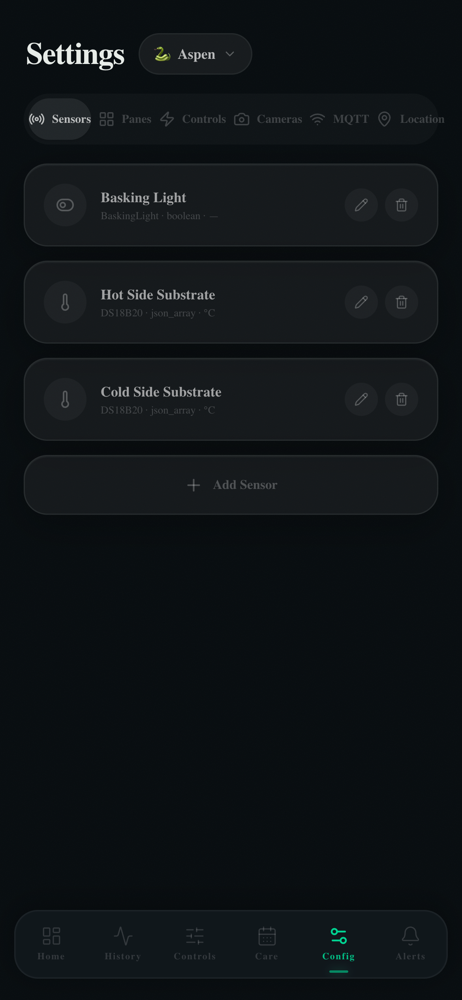

# Config (Settings)

The Config page is the central settings hub. It is split into tabbed sections — Sensors, Panes, Controls, Cameras, MQTT, and Location — each managing a different aspect of your enclosure setup.

---

## Sensors

Defines each sensor that publishes data to your MQTT broker. Sensors configured here appear as widgets on the Dashboard and as selectable overlays on the History chart.

### Adding a Sensor

Tap **+ Add Sensor** to open the sensor form:

| Field | Description |
|-------|-------------|
| **Name** | Display name (e.g. "Hot Side Substrate") |
| **MQTT Topic** | Full topic the sensor publishes to (e.g. `enclosure/hot_side`) |
| **Sensor type** | DS18B20, DHT22, BME280, boolean, custom |
| **Payload format** | `json_array`, `json_object`, `plain_value` |
| **Unit** | `°C`, `°F`, `%`, `boolean`, or custom |
| **Thresholds** | Warning low/high and critical low/high values |

### Payload Formats

| Format | Example payload | Notes |
|--------|----------------|-------|
| `json_array` | `[87.2, 45.1]` | Index 0 = temperature, index 1 = humidity |
| `json_object` | `{"temperature": 87.2}` | Key names configurable |
| `plain_value` | `87.2` | Single numeric value |
| `boolean` | `ON` / `OFF` | For relay state sensors |

---

## Panes

Controls which sensor widgets appear on the Dashboard and in what order. Drag to reorder. Toggle the eye icon to show or hide a pane without deleting it.

---

## Controls

Lists all registered control devices (same as the Controls page). You can add, edit, and delete devices here as an alternative to the Controls page UI.

---

## Cameras

Configures camera sources for the optional motion detection and snapshot features.

| Field | Description |
|-------|-------------|
| **Name** | Camera display name |
| **Stream URL** | RTSP or MJPEG stream URL |
| **Snapshot URL** | Still image endpoint (for zone drawing) |
| **FPS** | Frame rate for motion detection (lower = less CPU) |
| **Sensitivity** | Motion detection threshold (0–100) |
| **Settle timeout** | Seconds of stillness before "settled" state is declared |

### Detection Zones

After saving a camera, tap **Draw Zones** to open the zone editor. Drag rectangles over the camera snapshot to define named zones (e.g. "Hot Hide", "Cold Side", "Water Bowl"). The motion detector will report which zone the animal is in via MQTT.

---

## MQTT

Configures the connection to your MQTT broker.

| Field | Default | Description |
|-------|---------|-------------|
| **Broker URL** | `mqtt://localhost:1883` | Host and port of your broker |
| **Username** | (blank) | Optional broker auth |
| **Password** | (blank) | Optional broker auth |
| **Topic prefix** | `enclosure` | Prepended to all sensor topic subscriptions |
| **Client ID** | Auto-generated | Unique identifier for this dashboard connection |

**Test Connection** button verifies broker reachability before saving.

---

## Location

Used to calculate accurate sunrise and sunset times for solar-scheduled lighting.

| Field | Description |
|-------|-------------|
| **Latitude** | Your latitude (decimal degrees, e.g. `37.7749`) |
| **Longitude** | Your longitude (decimal degrees, e.g. `-122.4194`) |
| **Timezone** | IANA timezone string (e.g. `America/Los_Angeles`) |

The solar schedule recomputes daily at midnight. Changes take effect at the next midnight or on save, whichever comes first.
