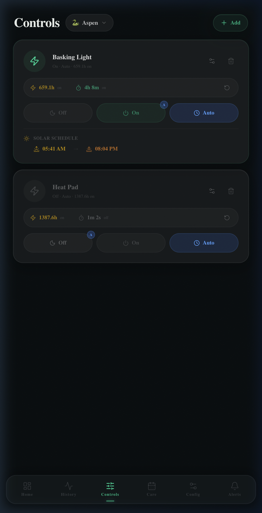

# Controls

The Controls page is the full device management interface. Each output device (heating, lighting, fans, etc.) is listed as a card with runtime stats, mode controls, and scheduling options.



---

## Device Cards

Each device card shows:

| Element | Description |
|---------|-------------|
| **Icon** | Color-coded by device state (green = on, dim = off) |
| **Name** | User-defined device name |
| **Status line** | Current mode and runtime summary |
| **Runtime row** | Total on-time and current session on/off duration |
| **Mode buttons** | Off / On / Auto |
| **⚙ button** | Opens device settings sheet |
| **🗑 button** | Delete device |

---

## Mode Buttons

| Mode | Behavior |
|------|---------|
| **Off** | Immediately cut power. Ignores schedules and PID. |
| **On** | Immediately apply power. Ignores schedules and PID. |
| **Auto** | Restore automated control (solar schedule or PID). The `A` badge appears when Auto is active. |

Modes persist across page reloads and are stored in the database.

---

## Solar Schedule (Basking Light)

Lighting devices support a **solar schedule** — the light turns on at sunrise and off at sunset, calculated from your configured latitude/longitude.

The card shows:
- 🌅 **Sunrise time** — when the light will turn on today
- 🌇 **Sunset time** — when the light will turn off today

Configure your coordinates in Config → Location.

---

## PID Control (Heat Pad)

Heating devices with PID enabled show additional information:

### PID Status Row

```
PID  -0.0°  100%  ⚙
```

| Value | Meaning |
|-------|---------|
| `-0.0°` | Error — difference between setpoint and current reading |
| `100%` | Current duty cycle being applied to the heating element |
| ⚙ | Opens PID tuning sheet |

### Setpoint

The setpoint badge (e.g. `87° setpoint`) shows the target temperature. Tap it to edit inline — changes take effect immediately and persist.

### PID Detail Sheet

Tap the ⚙ icon to open the PID tuning sheet:

| Parameter | Description |
|-----------|-------------|
| **Setpoint** | Target temperature in configured units |
| **Kp** | Proportional gain — how aggressively to respond to error |
| **Ki** | Integral gain — corrects persistent offset over time |
| **Kd** | Derivative gain — dampens overshoot |
| **Min duty** | Minimum PWM output (prevents relay chatter) |
| **Max duty** | Maximum PWM output (safety cap) |
| **Window** | PID calculation window in seconds |

---

## Runtime Stats

Each card tracks cumulative device runtime:

- **Total on-time** — lifetime hours the device has been powered (e.g. `769.4h on`)
- **Session time** — how long the device has been in its current state (e.g. `20s off`)
- **↺ Reset** — clears runtime counters (useful after replacing a bulb or heating element)

---

## Adding a Device

Tap **+ Add** in the top right to register a new control device. You'll specify:

- Name
- Type (light, heat, fan, pump, other)
- Control mode (on/off toggle or PID)
- MQTT command topic (the topic HabitatMQ publishes to when toggling the device)
- Linked sensor (for PID — which sensor reading drives the loop)
