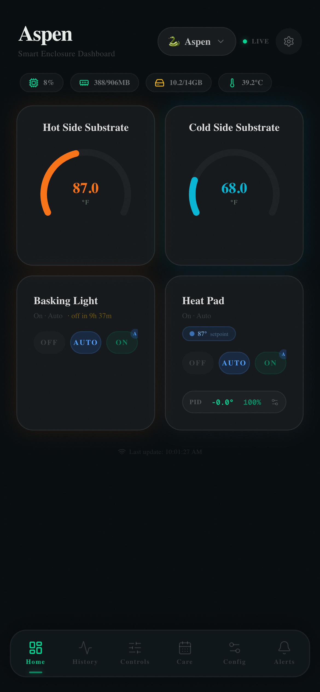

# Dashboard

The Dashboard is the home screen of HabitatMQ. It shows a live view of your enclosure's current state — sensor readings, device statuses, and Pi system health — all updating in real-time via MQTT.



---

## Layout

The dashboard is organized into four zones:

```
┌─────────────────────────────────┐
│  Animal name + picker   [LIVE] ⚙│  ← Header
├─────────────────────────────────┤
│  CPU%  RAM  Disk  Temp          │  ← Pi system stats
├──────────────┬──────────────────┤
│  Hot Side    │  Cold Side       │  ← Sensor widgets
│  Substrate   │  Substrate       │
├──────────────┼──────────────────┤
│  Basking     │  Heat Pad        │  ← Control widgets
│  Light       │  (PID)           │
└─────────────────────────────────┘
```

---

## Sensor Widgets

Each sensor shows a **radial gauge** with the current reading and color-coded status:

| Color | Meaning |
|-------|---------|
| 🟠 Orange | Hot side — within normal range |
| 🔵 Cyan | Cold side — within normal range |
| 🔴 Red | Above warning threshold |
| 🔵 Blue | Below warning threshold |

The gauge arc fills proportionally between the configured min and max thresholds. Readings update live as MQTT messages arrive.

---

## Control Widgets

Each control device (basking light, heat pad, etc.) shows:

- **Current state** — On / Off / Auto
- **Mode badge** — `A` indicates Auto mode is active
- **Status line** — e.g. "On · Auto · off in 9h 37m" for a scheduled light

### Mode buttons

| Button | Behavior |
|--------|---------|
| **OFF** | Force device off immediately, disables schedule |
| **AUTO** | Restore to scheduled / PID-controlled operation |
| **ON** | Force device on immediately, overrides schedule |

---

## PID Widget (Heat Pad)

The heat pad widget shows additional PID information when PID control is enabled:

- **Setpoint badge** — e.g. `87° setpoint` — tap to edit inline
- **PID status row** — shows error offset and current duty cycle (`-0.0° 100%`)
- **⚙ button** — opens the PID detail sheet with tuning parameters

---

## Pi System Stats

The top stat bar shows live Raspberry Pi health:

| Stat | Source |
|------|--------|
| CPU % | `/proc/stat` |
| RAM used / total | `/proc/meminfo` |
| Disk used / total | `df /` |
| CPU temperature | `/sys/class/thermal/thermal_zone0/temp` |

These poll every 5 seconds via the `/api/system` endpoint.

---

## Animal Picker

Tap the **animal pill** in the header to switch between enclosure inhabitants. All widgets — sensors, controls, care history — filter to the selected animal. The `LIVE` badge confirms the SSE stream is connected.

---

## Real-Time Updates

The dashboard uses **Server-Sent Events (SSE)** via `/api/stream` to push updates without polling. When a new MQTT message arrives on the broker, it flows through:

```
MQTT broker → Pi MQTT subscriber → SQLite → SSE push → Dashboard widgets
```

The "Last update" timestamp at the bottom shows when the most recent sensor reading was received.

---

## Navigation

The bottom tab bar is always visible:

| Tab | Page |
|-----|------|
| 🏠 Home | Dashboard (this page) |
| 📈 History | Sensor trend charts |
| 🎛 Controls | Full device control list |
| 📅 Care | Care log calendar |
| ⚙ Config | Settings |
| 🔔 Alerts | Alert history |
