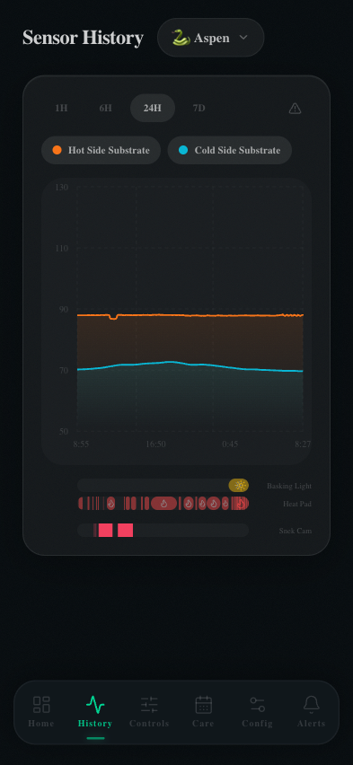

# Sensor History

The History page shows time-series charts of your enclosure's sensor readings. Use it to spot temperature drift, identify heating failures, or verify your gradient is stable over time.



---

## Time Range Selector

Four time windows are available via the pill buttons at the top:

| Button | Window | Data resolution |
|--------|--------|----------------|
| **1H** | Last 1 hour | ~1 reading/min |
| **6H** | Last 6 hours | ~1 reading/min |
| **24H** | Last 24 hours | ~5 min average |
| **7D** | Last 7 days | ~30 min average |

Longer windows use averaged data to keep charts responsive. Raw per-minute data is always stored in SQLite.

---

## Sensor Toggles

Each configured sensor appears as a toggleable chip below the time selector. Tap to show or hide that sensor's line on the chart. Active sensors are highlighted.

| Sensor | Color |
|--------|-------|
| Hot Side Substrate | 🟠 Orange |
| Cold Side Substrate | 🔵 Cyan |
| Additional sensors | Auto-assigned |

---

## Chart

The area chart shows temperature over time with:

- **Filled area** under each line — makes gradient spread visually obvious
- **Smooth curve** — `basis` interpolation reduces visual noise from sensor jitter
- **Y-axis** — scaled to your configured min/max thresholds, not auto-zoomed
- **Threshold reference lines** — dashed lines at warning and critical levels

### Reading a healthy gradient

A well-maintained enclosure should show:
- Hot side holding steady at setpoint (e.g. 87–90°F)
- Cold side in a stable cooler range (e.g. 68–72°F)
- Both lines flat with minimal oscillation

### Spotting problems

| Pattern | Possible cause |
|---------|---------------|
| Hot side dropping toward cold | Heat pad off or failed |
| Both sides rising together | Ambient temperature spike |
| Rapid oscillations | PID tuning too aggressive |
| Flat line at 0 | Sensor disconnected / MQTT not publishing |

---

## Activity Timeline

Below the chart, a **device activity timeline** shows when heating and lighting devices were on or off, overlaid on the same time axis. This makes it easy to correlate temperature changes with device state changes.

- **Yellow bar** — Basking light on periods
- **Red flame icons** — Heat pad on/duty cycles

---

## Alert Indicators

The ⚠ icon in the top-right corner of the chart card appears when one or more readings in the selected window exceeded a threshold. Tap it to jump to the Alerts page.

---

## Data Storage

All sensor readings are stored locally in SQLite at `data/enclosure.db`. There is no data retention limit by default — readings accumulate indefinitely. If disk space becomes a concern on your Pi, add a cron job to prune old rows:

```sql
DELETE FROM sensor_readings WHERE recorded_at < datetime('now', '-90 days');
```
